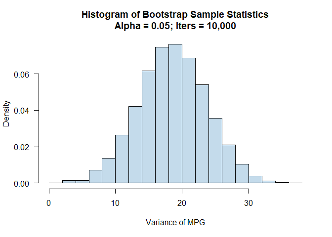

Final Project - Intro to R
================
Daniel Carpenter
12/13/2020

-   [Introduction](#introduction)
-   [Data](#data)
-   [Theory Used](#theory-used)
-   [Application of SLR to the mtcars data
    set](#application-of-slr-to-the-mtcars-data-set)
    -   [Making the SLR function:
        `myslr()`](#making-the-slr-function-myslr)
    -   [Invoke `myslr()` function using the `mtcars` data
        set](#invoke-myslr-function-using-the-mtcars-data-set)
    -   [Plot Output](#plot-output)
    -   [Normal Interval Check](#normal-interval-check)
    -   [Fitted vs. Residuals](#fitted-vs-residuals)
    -   [Interpretation of Model](#interpretation-of-model)
    -   [Validity of the Model](#validity-of-the-model)
-   [Bootstrap](#bootstrap)
    -   [Make Bootstrap Function](#make-bootstrap-function)
    -   [Invoke `myboot()` Function](#invoke-myboot-function)

# Introduction

Within the `Project1.Rmd` file and this `Project1.pdf` file, the user
can create a linear regression between two variables; also, the user can
use a bootstrapping function. Within the function `myslr()`, the user
estimates the relationship between two variables, as well show the
confidence in those estimates.

Within the bootstrapping function `myboot()`, the user can use a limited
sample to infer information about a population’s variance. The function
will output a confidence interval, some summary statistics, and a
histogram showing the possible outcomes of a given variable.

# Data

Within the examples in this file, the `mtcars` data set provides
meaningful information when estimating linear regressions and
bootstrapping. This data set includes information from the 1974 US
magazine, and “comprises fuel consumption,” as well as “10 aspects” of
each of the thirty-two cars in the data set. These “aspects” resemble
the variables within the data, such as miles per gallon.

When considering the variables in the `mtcars` data set, it is useful to
understand the types of data, which help best determine how to analyze
the data. Please see the variables, their descriptions, and their data
types below.

# Theory Used

`Y` Represents the dependent, or explained, variable. represents the
estimated intercept. represents the slope of the estimated vector.
represents the independent, or control, variable. represents some error
term.

# Application of SLR to the mtcars data set

## Making the SLR function: `myslr()`

``` r
  myslr <- function(data,
                      y, yName, 
                      x, xName, 
                      sizeVar, sizeVarName, 
                      colVar, colVarName,
                      titleVar) 
  {
    # Open Window to View Plot
      windows(title = "Linear Estimation Graph for Y on X")
    
    # Create Plot
      plot <- ggplot(
                    # Data
                      data, 
                    
                    # Aesthetic Mapping
                      aes(x, y, 
                         color  = colVar,
                         size   = sizeVar)) +
        
                    # Add Scatter Layer
                      geom_point(alpha = 2/5) +  
                    
                    # Add Linear Estimation
                      geom_smooth(method  = "lm", 
                                  formula = y ~ x,
                                  color   = "grey35") +
                    
                    # Titles
                      labs(title     = titleVar,
                           subtitle  = " ",
                           x         = xName,
                           y         = yName,
                           col       = colVarName,
                           size      = sizeVarName) +
                    
                    # Theme
                      theme_get()
            
    # show Plot
      print(plot)
      
    # Save plot
      ggsave(filename  = paste0("Simple Linear Regression Plot.png"),
             plot      = plot,
             height    = 6,
             width     = 8)
     
      
    # Linear Estimation and Summary Output 
      
      ## Linear Regression (returned)
        y.lm <- lm(y ~ x)
        
      ## Linear Regression Output (void)
        print(summary(y.lm)) 
      
      ## Confidence Interval at 95% (void)
        CI <- ciReg(y.lm)
        CI
        write.csv(CI, file = "Confidence Intervals.csv")
        
      ## Check assumptions and save .png
        png("Normal Interval Check.png", height = 150, width = 500)
        normcheck(y.lm) 
        dev.off()
        
      ## Check residuals and save .png
        png("Fitted vs. residuals Plot.png", height = 250, width = 500)
        plot(y.lm, which = 1) 
        dev.off()
        
      ## Linear Estimation
        return(y.lm)
  }
```

## Invoke `myslr()` function using the `mtcars` data set

``` r
  # Call Get Linear Estimation for y on x
    y.lm <- myslr(data = mtcars,
                  mtcars$mpg,   "Miles per Gallon", 
                  mtcars$wt,    "Weight of Vehicle",
                  mtcars$disp,  "Displacement (cub. inches)", 
                  mtcars$cyl,   "Number of Cylinders",
                  "Simple Linear Regression Plot")
```

    ## 
    ## Call:
    ## lm(formula = y ~ x)
    ## 
    ## Residuals:
    ##     Min      1Q  Median      3Q     Max 
    ## -4.5432 -2.3647 -0.1252  1.4096  6.8727 
    ## 
    ## Coefficients:
    ##             Estimate Std. Error t value Pr(>|t|)    
    ## (Intercept)  37.2851     1.8776  19.858  < 2e-16 ***
    ## x            -5.3445     0.5591  -9.559 1.29e-10 ***
    ## ---
    ## Signif. codes:  0 '***' 0.001 '**' 0.01 '*' 0.05 '.' 0.1 ' ' 1
    ## 
    ## Residual standard error: 3.046 on 30 degrees of freedom
    ## Multiple R-squared:  0.7528, Adjusted R-squared:  0.7446 
    ## F-statistic: 91.38 on 1 and 30 DF,  p-value: 1.294e-10
    ## 
    ##             95 % C.I.lower    95 % C.I.upper
    ## (Intercept)       33.45050          41.11975
    ## x                 -6.48631          -4.20263

``` r
  # Coefficient list
    coefsList <- y.lm$coefficients
```

## Plot Output


## Normal Interval Check


## Fitted vs. Residuals


## Interpretation of Model

Within the model, it estimates that an increase of 1,000 pounds in
weight of a given car decreases the miles per gallon of the vehicle by
5.34. Additionally, the model estimates that changes in weight account
for 75.28% of the variation in the car’s miles per gallon.

At a 95% level of confidence, the model estimates the lower bound to be
a 6.49 decrease in miles per gallon when increasing the weight of a car
by 1,000 pounds. Alternatively, the model estimates the upper bound to
be a 4.20 decrease in miles per gallon when increasing the weight of a
car by 1,000 pounds.

## Validity of the Model

Although the model estimates a narrow confidence interval with a
relatively high R-squared value, we may not assume that solely weight
accounts for the full 76.28% variation in miles per gallon. This
variable could easily be correlated with another relevant variable, thus
confounding the simple linear regression.

# Bootstrap

## Make Bootstrap Function

``` r
myboot <- function(iter   = 10000, # num iterations
                   x,              # dataset
                   fun    = "var", #
                   alpha  = 0.05,  # 95% confidence
                   cx     = 1.5,
                   ...
                   )
{
  # Get Sample size
    n = length(x)
  
  # Create Sample
    y = sample(x, 
               n * iter,
               replace = TRUE)
    
  # Form Matrix from sample
    rs.mat = matrix(y, # data from sampling
                    nrow  = n,
                    ncol  = iter,
                    byrow = TRUE) # sort by row

  # Variance
    xstat = apply(rs.mat, 2, fun) # vector containing iter vals
    
  # Form confidence interval
    ci = quantile(xstat,
                  c(alpha / 2,
                    1 - alpha / 2)
                    )
    
  # Send summary Statistics to the console
    
    ## Confidence Interval Out
      print("____________________________________________")
      print(paste0("Confidence Interval at Alpha = ", alpha))
      print("--------------------------------------------")
      print(ci)
    
      
    ## Form matrix of sample stats    
    statNames <- c("Mean:", "Median:", "Standard Deviation:")
    statVals  <- c(comma(mean  (xstat), digits = 2),
                   comma(median(xstat), digits = 2),
                   comma(sd    (xstat), digits = 2)
                   )
    summaryStats <- matrix(data = c(statNames,
                                    statVals),
                           nrow = 3,
                           ncol = 2)
    
    ##  Sample Stats Out
    print("____________________________________________")
    print("Summary Statistics from Bootstrap Sampling:")
    print("--------------------------------------------")
    print(summaryStats)
  
  # Create a histogram from Bootstrap sampling
    para <-  hist(
                  xstat,
                  freq = FALSE, # along numberline, not freq
                  las  = 1,
                  main = paste0("Histogram of Bootstrap Sample Statistics",
                                "\n",
                                "Alpha = ", alpha, "; ",
                                "Iters = ", comma(iter, digits = 0)),
                  col  = alpha("skyblue3", 2/5),
                  ...)
    
    # Save Bootstrap plot
      png("Bootstrap Estimate Plot.png", height = 150, width = 500)
      para
      dev.off()
    
    # write a file to current directory with sample data
      write.csv(xstat, "Bootstrap Estimations.csv")
    
    return(xstat)
}
```

## Invoke `myboot()` Function

### Get data from `mtcars`, while only containing 4 cylinder cars

``` r
  # Get dataset from mtcars
  df <- mtcars %>%
    
    ## filter to only 4-cylinder cars
      filter(cyl == 4) %>%
    
    ## Only show vars of interest
      select(mpg)
  
    ## Store as vector
      df.vector <- df$mpg
```

### Call `myboot()` Function and Store Estimations in List

``` r
    varianceData <- myboot(iter  = 10000,
                           x     = df.vector,
                           alpha = 0.05,
                           cx    = 1.5,
                           xlab  = "Variance of MPG")
```

    ## [1] "____________________________________________"
    ## [1] "Confidence Interval at Alpha = 0.05"
    ## [1] "--------------------------------------------"
    ##      2.5%     97.5% 
    ##  8.428727 28.608545 
    ## [1] "____________________________________________"
    ## [1] "Summary Statistics from Bootstrap Sampling:"
    ## [1] "--------------------------------------------"
    ##      [,1]                  [,2]              
    ## [1,] "Mean:"               "18.5814322545455"
    ## [2,] "Median:"             "18.5822727272727"
    ## [3,] "Standard Deviation:" "5.10568727841268"

<!-- -->
